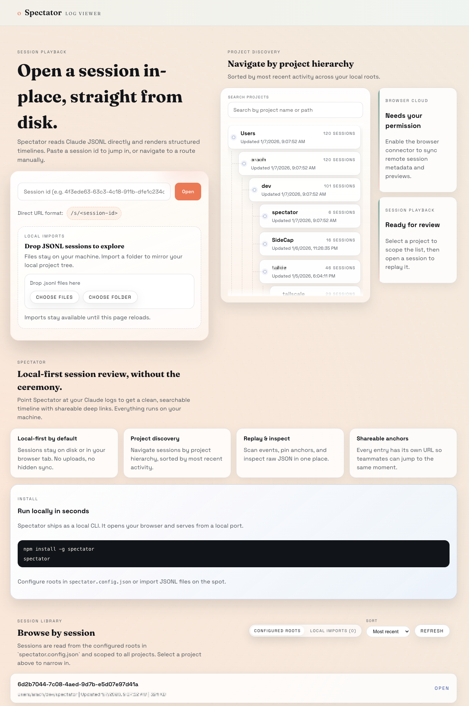

# Spectator

Spectator is a local-first web app for reviewing Claude JSONL sessions directly from disk. It renders structured timelines, supports fast navigation, and keeps the raw JSON line visible in an inspector.



## Features

- Session listing grouped by project with sorting controls.
- Timeline view with category filters, density toggle, and minimap scrubber.
- Command blocks for tagged user messages (`<command-name>`, `<command-args>`, `<command-message>`, `<local-command-stdout>`).
- Tool calls/results, code blocks with syntax highlighting, and image attachments.
- File history snapshots with quick view and diff previews.
- Raw JSON inspector for every entry.

## Setup

```bash
bun install
```

## Development

Run the UI and the local API server in separate terminals:

```bash
bun run dev
bun run dev:server
```

Then visit:

```
http://localhost:5173
```

Open a session from the list or jump directly to:

```
http://localhost:5173/s/<session-id>
```

## Configuration

Edit `spectator.config.json` to point at your local log roots:

```json
{
  "roots": ["~/.claude/projects"],
  "maxDepth": 5,
  "port": 8787
}
```

## File History (Optional)

If you have Claude file history backups, Spectator will surface snapshot diffs by reading:

```
~/.claude/file-history
```

You can override this path in `server.ts` if needed.

## Limitations

- Long code blocks and diffs are truncated to the first 10 lines for readability.
- The initial pass is focused on Claude JSONL. OpenAI support is planned next.

## Production

```bash
bun run build
bun run start
```
